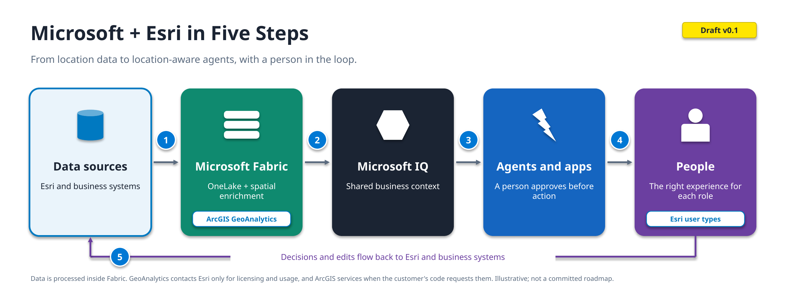
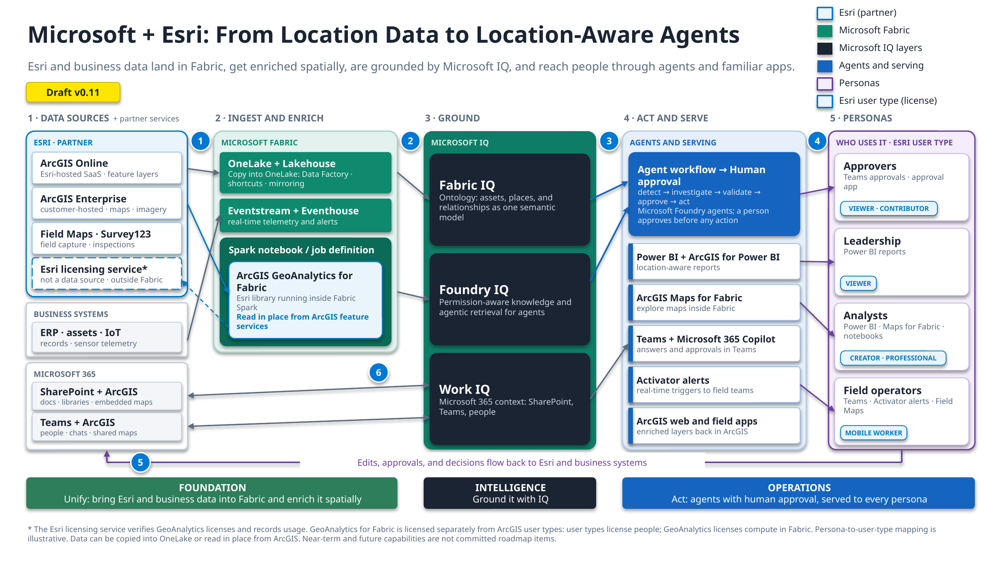

# Appendix: Reading the Foundation Diagrams

This appendix explains the visual elements in the two diagrams on the [Microsoft + Esri Foundation](README.md) page.

---

## The Five-Step Diagram

| Element | Meaning |
|---|---|
| Numbered tiles (1 to 5) | The five steps of the story, read left to right. Each matches a numbered step on the [Foundation page](README.md#the-story-in-one-view). |
| Tile colors | Light blue with an Esri outline: data sources (Esri partner). Green: Microsoft Fabric. Navy: Microsoft IQ. Blue: agents and apps. Purple: people. |
| Icons | Official Microsoft and Esri product icons identify the products in each step. The Microsoft IQ tile uses the Microsoft IQ visual. The People tile uses a generic figure because no product icon applies. |
| ArcGIS GeoAnalytics chip | The Esri capability that runs inside Microsoft Fabric to enrich data spatially. |
| Esri user types chip | Each persona is matched to the Esri user type it typically needs (illustrative). |
| Gray arrows | Data and context moving forward from one step to the next. |
| Purple loop | Decisions and edits flowing back to Esri and business systems. |
| Footnote | Data is processed inside Fabric. GeoAnalytics contacts Esri only for licensing and usage, and ArcGIS services only when the customer's code requests them ([Evidence SEC-007 to SEC-009](../02-GeoAnalytics-for-Fabric/records/Evidence.md)). |

---

## The Detailed View

| Element | Meaning |
|---|---|
| Column headings (1 to 5) | The five steps of the story, read left to right. Each matches a step on the [Foundation page](README.md#the-story-in-one-view) and a row in the column table below. |
| Lane colors | Light blue with an Esri outline: Esri (partner). Green: Microsoft Fabric. Navy cards on a green panel: Microsoft IQ layers. Blue: agents and serving. Purple: personas. Gray lanes: business systems and Microsoft 365. |
| Blue numbered bubbles | The flows between columns: **1** Esri and business data into Fabric. **2** Enriched data grounded by Microsoft IQ. **3** Grounded context to agents and apps. **4** Outcomes to each persona. **5** The feedback loop back to Esri and business systems. **6** Work IQ exchanging context and answers with Microsoft 365. |
| Gray and blue arrows | Data and context moving forward. The Esri-blue arrow is GeoAnalytics reading ArcGIS feature services in place. |
| Purple arrows | Outcomes reaching personas, and decisions and edits flowing back. |
| Dashed Esri licensing service* | The only call GeoAnalytics makes on its own: license authorization and usage reporting over HTTPS to arcgis.com. It is not a data source. Feature-service reads and writes and basemap tiles happen only when the customer's code requests them ([Evidence SEC-007 to SEC-009](../02-GeoAnalytics-for-Fabric/records/Evidence.md)). |
| Esri user type chips | Each persona is matched to the Esri user type it typically needs (illustrative). User types license people; GeoAnalytics is licensed separately, by compute. |
| Foundation, Intelligence, Operations band | The adoption path, in order: **Foundation** (unify Esri and business data in Fabric and enrich it spatially), **Intelligence** (ground it with Microsoft IQ), **Operations** (act through agents with human approval, served to every persona). Each builds on the one before. |

**What happens in each column**

| Column | What happens |
|---|---|
| 1 · Data sources | Esri, business, and Microsoft 365 data are where the story starts. |
| 2 · Ingest and enrich | Data is copied into OneLake or read in place from ArcGIS, then enriched spatially with ArcGIS GeoAnalytics running inside Fabric Spark. |
| 3 · Ground | Microsoft IQ (Fabric IQ, Foundry IQ, Work IQ) gives agents and people shared business context. |
| 4 · Act and serve | Agents propose actions, a person approves them, and results reach Power BI, ArcGIS Maps for Fabric, Teams, Activator, and ArcGIS apps. |
| 5 · Personas | Each audience is matched to the Esri user type it typically needs (illustrative). |

---

**Back:** [Microsoft + Esri Foundation](README.md)
