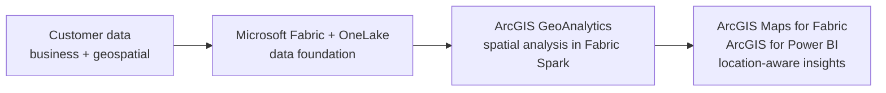

# Microsoft + Esri Foundation

> **Status:** In progress. The elevator-pitch diagram is a placeholder; the integration landscape is current.

## Purpose

This section introduces the Microsoft + Esri story before going into individual components. It answers one question: **what do Microsoft Fabric and Esri do together, and why does it matter to the customer?**

Each component folder that follows (GeoAnalytics, Maps for Fabric, Power BI) goes deeper into one part of that story, with its own customer guidance, end-to-end scenario, and reference architecture.

---

## The Story in One View

<!-- TODO: Replace with the simplified "elevator pitch" landscape image.
     Save it as 01-Microsoft-Esri-Foundation/images/microsoft-esri-elevator-pitch.png
     and replace the diagram below with:
      -->

*Interim view until the elevator-pitch diagram is added:*

---

## Microsoft + Esri Fabric Integration Landscape

Organizations increasingly need to combine enterprise business data with location intelligence to improve planning, operations, asset management, customer engagement, and decision-making.

Microsoft Fabric provides the enterprise data and analytics foundation. Esri extends that foundation with geospatial intelligence, enabling organizations to combine business data, operational data, and location data within a shared analytics environment.

The opportunity is not simply to visualize data on a map. The opportunity is to help customers unify enterprise and geospatial data so that location becomes part of analytics, decision-making, and AI workflows. By combining organizational data with spatial relationships, proximity, movement, networks, and geographic context, customers can uncover insights that traditional business intelligence alone cannot provide.

### Current Microsoft + Esri Integration Portfolio

The current Microsoft + Esri Fabric landscape is anchored by three capabilities that are available today:

| Capability | Purpose |
|------------|----------|
| **ArcGIS GeoAnalytics for Microsoft Fabric** | Distributed geospatial analytics running within Fabric Spark environments |
| **ArcGIS Maps for Microsoft Fabric** | Native mapping and spatial visualization within Fabric |
| **ArcGIS for Power BI** | Location-aware dashboards and reporting for business users |

Together, these capabilities enable customers to move from storing and governing data in Microsoft Fabric to performing geospatial analysis, visualizing results geographically, and delivering location-aware insights through existing analytics workflows.

## Understanding the Landscape

The diagram is organized around three horizons: current capabilities, near-term validation efforts, and future opportunities.

### 🟢 Current (Available Today)

The current Microsoft + Esri portfolio focuses on helping customers incorporate geospatial intelligence directly into Fabric and Power BI workflows.

**Current capabilities include:**

- ArcGIS GeoAnalytics for Microsoft Fabric
- ArcGIS Maps for Microsoft Fabric
- ArcGIS for Power BI

These capabilities are available today and represent the foundation of the Microsoft + Esri Fabric integration portfolio.

### 🔵 Near-Term (Validation & Development)

The near-term focus is understanding customer demand, validating technical patterns, and identifying where Microsoft and Esri can create additional value.

**Current workstreams include:**

- GeoIQ
- Customer Strategy Validation
- Microsoft + Esri Architectural Reference Pattern
- Expanded Industry Scenarios

The objective is to validate customer adoption patterns, licensing and deployment considerations, and reusable implementation guidance that can accelerate future customer success.

### 🟣 Future (Roadmap Opportunities)

The future horizon explores how geospatial intelligence may participate in AI-native and agent-based experiences.

**Future areas of exploration include:**

- ArcGIS MCP Server
- Location-Aware Agents
- Microsoft Foundry Integration
- Copilot and Teams Experiences
- Deeper Microsoft + Esri Interoperability

These opportunities build on the current Fabric foundation and should be informed by customer demand, technical validation, and engineering alignment. They should not be interpreted as committed product roadmap items.

### Reading the Diagram

The landscape follows a simple progression:

**Enterprise Data → Geospatial Intelligence → AI-Powered Outcomes**

1. Microsoft Fabric and OneLake provide the enterprise data foundation.
2. ArcGIS GeoAnalytics for Microsoft Fabric, ArcGIS Maps for Microsoft Fabric, and ArcGIS for Power BI add geospatial analytics, visualization, and location-aware business intelligence.
3. GeoIQ represents a near-term opportunity to create a reusable location intelligence layer across analytics and AI experiences.
4. ArcGIS MCP and location-aware agents represent future opportunities to enable AI systems to reason over and act on geospatial relationships.
5. Customer outcomes include unifying business and geospatial data, operating spatial analytics at enterprise scale, delivering location-aware insights, and accelerating decision-making across industries.

> **Executive Takeaway**
>
> Microsoft Fabric provides the enterprise data foundation. Esri contributes geospatial intelligence through analytics, visualization, and business intelligence today, while GeoIQ and future MCP-enabled agent experiences represent opportunities to extend location intelligence into AI-driven workflows.

---

## Components in This Library

| # | Component | Role in the story | Status |
|---|---|---|---|
| 02 | [ArcGIS GeoAnalytics for Microsoft Fabric](../02-GeoAnalytics-for-Fabric/) | Spatial processing and enrichment in Fabric Spark | In progress |
| 03 | ArcGIS Maps for Microsoft Fabric | Mapping and spatial visualization within Fabric | Planned |
| 04 | ArcGIS for Power BI | Location-aware reporting for business users | Planned |

See the [Architecture Map](../Architecture-Mapping.md) for the full library, including near-term and future horizons.

---

## Scope

This section is an introduction, not an implementation guide. Implementation guidance, architectures, and evidence live in each component folder. Near-term and future items (such as GeoIQ, ArcGIS MCP Server, and location-aware agents) are opportunities under exploration, not committed product roadmap items.

---

**Next:** [02 · ArcGIS GeoAnalytics for Microsoft Fabric →](../02-GeoAnalytics-for-Fabric/)
