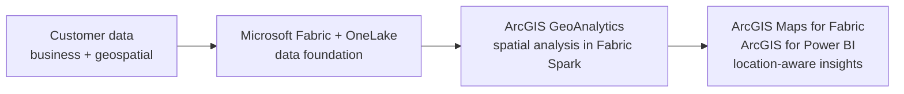

# Microsoft + Esri Foundation

> **Status:** Placeholder. The elevator-pitch diagram and narrative below are drafts to be finalized.

## Purpose

This section introduces the Microsoft + Esri story before going into individual components. It answers one question: **what do Microsoft Fabric and Esri do together, and why does it matter to the customer?**

Each component folder that follows (GeoAnalytics, Maps for Fabric, Power BI) goes deeper into one part of that story, with its own customer guidance, end-to-end scenario, and reference architecture.

---

## The Story in One View

<!-- TODO: Replace with the simplified "elevator pitch" landscape image.
     Save it as 01-Microsoft-Esri-Foundation/images/microsoft-esri-elevator-pitch.png
     and replace the diagram below with:
      -->

*Interim view until the elevator-pitch diagram is added:*

---

## Narrative

<!-- TODO: Finalize. Draft drawn from existing Customer Guidance content. -->

Organizations increasingly need to combine enterprise business data with location intelligence to improve planning, operations, asset management, customer engagement, and decision-making.

**Microsoft Fabric** provides the enterprise data and analytics foundation. **Esri** extends that foundation with geospatial intelligence, so business data, operational data, and location data can be analyzed together in a shared environment.

The opportunity is not simply to put data on a map. It is to make location part of analytics, decision-making, and, over time, AI workflows.

---

## Components in This Library

| # | Component | Role in the story | Status |
|---|---|---|---|
| 02 | [ArcGIS GeoAnalytics for Microsoft Fabric](../02-GeoAnalytics-for-Fabric/) | Spatial processing and enrichment in Fabric Spark | In progress |
| 03 | ArcGIS Maps for Microsoft Fabric | Mapping and spatial visualization within Fabric | Planned |
| 04 | ArcGIS for Power BI | Location-aware reporting for business users | Planned |

See the [Architecture Map](../Architecture-Mapping.md) for the full library, including near-term and future horizons.

---

## Scope

This section is an introduction, not an implementation guide. Implementation guidance, architectures, and evidence live in each component folder. Near-term and future items (such as GeoIQ, ArcGIS MCP Server, and location-aware agents) are opportunities under exploration, not committed product roadmap items.

---

**Next:** [02 · ArcGIS GeoAnalytics for Microsoft Fabric →](../02-GeoAnalytics-for-Fabric/)
