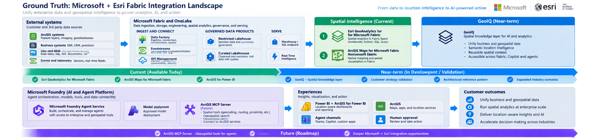

# Microsoft + Esri Foundation

> **Status:** In progress. The five-step diagram (v0.5) and the detailed view (v0.10) are drafts; the integration landscape is current.

## Purpose

This section introduces the Microsoft + Esri story before going into individual components. It answers one question: **what do Microsoft Fabric and Esri do together, and why does it matter to the customer?**

Each component folder that follows (GeoAnalytics, Maps for Fabric, Power BI) goes deeper into one part of that story, with its own customer guidance, end-to-end scenario, and reference architecture.

---

## The Story in One View

**Microsoft + Esri turn location data into location-aware agents, with a person in the loop.**

> **The 30-second version:** Bring Esri and business data into Fabric. Enrich it spatially with GeoAnalytics. Ground it with Microsoft IQ. Let agents act, with a person approving, and deliver the outcome to every role.

[How to read this diagram](Appendix-Reading-the-Diagrams.md#the-five-step-diagram)

### 1. Data sources: start where the data lives

Location data lives in Esri: ArcGIS Online, ArcGIS Enterprise, and field apps. Operational data lives in business systems such as ERP, asset management, and IoT. The story starts by bringing both together instead of keeping maps and business records apart.

### 2. Microsoft Fabric: unify and enrich

Data lands in OneLake, either copied in or read in place from ArcGIS. ArcGIS GeoAnalytics runs inside Fabric Spark to add spatial context such as proximity, tracks, hot spots, and spatial joins. The data is processed inside Fabric.

### 3. Microsoft IQ: ground it in business context

Microsoft IQ models and indexes the enriched data so agents understand what it means. Work IQ, Fabric IQ, Foundry IQ, and Web IQ connect how people work, how the business operates, reusable knowledge, and current information from the web. The data stays in OneLake.

### 4. Agents and apps: act with a person in the loop

Foundry agents and Copilot propose actions, and a person approves before anything changes. Results also surface in Power BI and ArcGIS Maps for Fabric, so insight reaches people through familiar tools.

### 5. People: the right experience for each role

Approvers, leaders, analysts, and field operators each get the experience their role needs, matched to the Esri user type they typically hold (illustrative). Decisions and edits flow back to Esri and business systems, closing the loop.

### The Detailed View

The same five steps with named components, for audiences who want the next level of detail. It shows the three IQ layers this scenario uses directly: Fabric IQ, Foundry IQ, and Work IQ.

Bubbles 1 to 5 follow the five steps above. The detailed view adds one more:

- **6. Microsoft 365: meet people where they work.** Work IQ draws context from SharePoint, Teams, and people, and returns answers there.

[How to read this diagram](Appendix-Reading-the-Diagrams.md#the-detailed-view)

These views introduce the story. The landscape below shows the wider portfolio and horizons. Implementation detail lives in each component folder.

---

## Microsoft + Esri Fabric Integration Landscape

Organizations increasingly need to combine enterprise business data with location intelligence to improve planning, operations, asset management, customer engagement, and decision-making.

Microsoft Fabric provides the enterprise data and analytics foundation. Esri extends that foundation with geospatial intelligence, enabling organizations to combine business data, operational data, and location data within a shared analytics environment.

The opportunity is not simply to visualize data on a map. The opportunity is to help customers unify enterprise and geospatial data so that location becomes part of analytics, decision-making, and AI workflows. By combining organizational data with spatial relationships, proximity, movement, networks, and geographic context, customers can uncover insights that traditional business intelligence alone cannot provide.

### Current Microsoft + Esri Integration Portfolio

The current Microsoft + Esri Fabric landscape is anchored by three capabilities that are available today:

| Capability | Purpose |
|------------|----------|
| **ArcGIS GeoAnalytics for Microsoft Fabric** | Distributed geospatial analytics running within Fabric Spark environments |
| **ArcGIS Maps for Microsoft Fabric** | Native mapping and spatial visualization within Fabric |
| **ArcGIS for Power BI** | Location-aware dashboards and reporting for business users |

Together, these capabilities enable customers to move from storing and governing data in Microsoft Fabric to performing geospatial analysis, visualizing results geographically, and delivering location-aware insights through existing analytics workflows.

## Understanding the Landscape

The diagram is organized around three horizons: current capabilities, near-term validation efforts, and future opportunities.

### Current (Available Today)

The current Microsoft + Esri portfolio focuses on helping customers incorporate geospatial intelligence directly into Fabric and Power BI workflows.

**Current capabilities include:**

- ArcGIS GeoAnalytics for Microsoft Fabric
- ArcGIS Maps for Microsoft Fabric
- ArcGIS for Power BI

These capabilities are available today and represent the foundation of the Microsoft + Esri Fabric integration portfolio.

### Near-Term (Validation & Development)

The near-term focus is understanding customer demand, validating technical patterns, and identifying where Microsoft and Esri can create additional value.

**Current workstreams include:**

- GeoIQ

> **GeoIQ** is this library's working term, not a Microsoft or Esri product name. It describes a reusable location-intelligence layer that brings Esri spatial context into Microsoft IQ (Fabric IQ, Foundry IQ, and Work IQ), so agents and analytics can reason over where things are and how they relate.
- Customer Strategy Validation
- Microsoft + Esri Architectural Reference Pattern
- Expanded Industry Scenarios

The objective is to validate customer adoption patterns, licensing and deployment considerations, and reusable implementation guidance that can accelerate future customer success.

### Future (Roadmap Opportunities)

The future horizon explores how geospatial intelligence may participate in AI-native and agent-based experiences.

**Future areas of exploration include:**

- ArcGIS MCP Server
- Location-Aware Agents
- Microsoft Foundry Integration
- Copilot and Teams Experiences
- Deeper Microsoft + Esri Interoperability

These opportunities build on the current Fabric foundation and should be informed by customer demand, technical validation, and engineering alignment. They should not be interpreted as committed product roadmap items.

### Reading the Diagram

The landscape follows a simple progression:

**Enterprise Data → Geospatial Intelligence → AI-Powered Outcomes**

1. Microsoft Fabric and OneLake provide the enterprise data foundation.
2. ArcGIS GeoAnalytics for Microsoft Fabric, ArcGIS Maps for Microsoft Fabric, and ArcGIS for Power BI add geospatial analytics, visualization, and location-aware business intelligence.
3. GeoIQ represents a near-term opportunity to create a reusable location intelligence layer across analytics and AI experiences.
4. ArcGIS MCP and location-aware agents represent future opportunities to enable AI systems to reason over and act on geospatial relationships.
5. Customer outcomes include unifying business and geospatial data, operating spatial analytics at enterprise scale, delivering location-aware insights, and accelerating decision-making across industries.

> **Executive Takeaway**
>
> Microsoft Fabric provides the enterprise data foundation. Esri contributes geospatial intelligence through analytics, visualization, and business intelligence today, while GeoIQ and future MCP-enabled agent experiences represent opportunities to extend location intelligence into AI-driven workflows.

---

## Top Five Microsoft + Esri Integrations

These five integrations carry the story from where ArcGIS runs, through Fabric, to the tools people use every day.

| # | Integration | What it does | Story step | Source |
|---|---|---|---|---|
| 1 | ArcGIS GeoAnalytics for Microsoft Fabric | Adds spatial queries, functions, and tools to Fabric Spark notebooks and Spark job definitions. | 2 · Microsoft Fabric | [Esri Architecture Center](https://architecture.arcgis.com/en/framework/architecture-pillars/integration/providers/microsoft.html); [Microsoft Learn](https://learn.microsoft.com/en-us/fabric/data-engineering/spark-arcgis-geoanalytics) |
| 2 | ArcGIS Maps for Microsoft Fabric | Interactive mapping and spatial visualization as a Fabric workload. | 4 · Agents and apps | [Microsoft Fabric blog](https://community.fabric.microsoft.com/t5/Fabric-Updates-Blog/Unlocking-Geospatial-Intelligence-in-Microsoft-Fabric-with-Esri/ba-p/5172470); [Microsoft Marketplace](https://marketplace.microsoft.com/en-us/product/saas/esri.arcgis-fabric-maps?tab=Overview) |
| 3 | ArcGIS for Power BI | A native Power BI visual that shows report data alongside ArcGIS Online or ArcGIS Enterprise layers. | 4 · Agents and apps | [Esri Architecture Center](https://architecture.arcgis.com/en/framework/architecture-pillars/integration/providers/microsoft.html) |
| 4 | ArcGIS for Microsoft 365 | Maps in Teams, SharePoint, and Excel, plus a declarative agent for Microsoft 365 Copilot in ArcGIS for Teams. | 4 · Agents and apps; 5 · People | [Esri Architecture Center](https://architecture.arcgis.com/en/framework/architecture-pillars/integration/providers/microsoft.html); [Esri announcement](https://www.esri.com/about/newsroom/announcements/esri-collaborates-with-microsoft-to-bring-arcgis-users-new-ai-enhancements) |
| 5 | ArcGIS on Microsoft Azure | Runs ArcGIS Enterprise on Azure compute, databases, and storage. | 1 · Data sources | [Esri](https://www.esriuk.com/en-gb/about/partners/our-partners/strategic-alliances/microsoft/azure-cloud/arcgis-on-azure) |

> **Status note:** ArcGIS Maps for Microsoft Fabric is described as available in a Microsoft Fabric blog post but is still listed as preview on Microsoft Marketplace. Confirm current status before presenting it as generally available.

Related patterns, not separate components: ArcGIS connectors for Power Automate support scheduled data loads, event triggers, and webhooks ([Esri Architecture Center](https://architecture.arcgis.com/en/framework/architecture-pillars/integration/providers/microsoft.html)), and Microsoft Entra ID provides sign-in across all five.

---

## Components in This Library

| # | Component | Role in the story | Status |
|---|---|---|---|
| 02 | [ArcGIS GeoAnalytics for Microsoft Fabric](../02-GeoAnalytics-for-Fabric/) | Spatial processing and enrichment in Fabric Spark | In progress |
| 03 | ArcGIS Maps for Microsoft Fabric | Mapping and spatial visualization within Fabric | Planned |
| 04 | ArcGIS for Power BI | Location-aware reporting for business users | Planned |
| 05 | ArcGIS for Microsoft 365 | Maps and Copilot agent experiences in Teams, SharePoint, and Excel | Planned |
| 06 | ArcGIS on Microsoft Azure | Hosting ArcGIS Enterprise on Azure infrastructure | Planned |

See the [Architecture Map](../Architecture-Mapping.md) for the full library, including near-term and future horizons.

---

## Scope

This section is an introduction, not an implementation guide. Implementation guidance, architectures, and evidence live in each component folder. Near-term and future items (such as GeoIQ, ArcGIS MCP Server, and location-aware agents) are opportunities under exploration, not committed product roadmap items.

---

**Next:** [02 · ArcGIS GeoAnalytics for Microsoft Fabric →](../02-GeoAnalytics-for-Fabric/)
