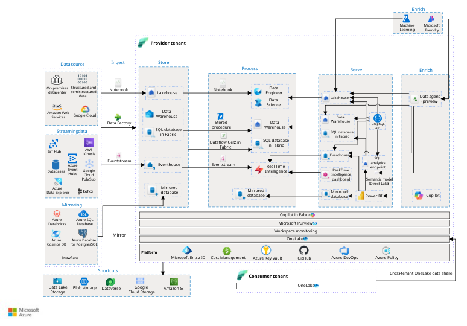

# ArcGIS GeoAnalytics for Microsoft Fabric: Architecture Guide

## Executive Summary

ArcGIS GeoAnalytics for Microsoft Fabric enables organizations to apply distributed geospatial analytics within Microsoft Fabric Spark environments. Together with ArcGIS Maps for Microsoft Fabric and ArcGIS for Power BI, it supports an integrated approach to combining business data and geospatial data within a common analytics foundation.

This guide summarizes where GeoAnalytics sits in the Microsoft + Esri landscape, shows where it participates within the Microsoft Fabric platform architecture, and introduces a practical framework for customer discovery and proof-of-concept planning. For the full landscape, see [01 · Microsoft + Esri Foundation](../01-Microsoft-Esri-Foundation/).

---

## Where GeoAnalytics Sits in the Microsoft + Esri Landscape

The Microsoft + Esri landscape is anchored by five integrations. Three run in Microsoft Fabric and Power BI: **ArcGIS GeoAnalytics for Microsoft Fabric**, **ArcGIS Maps for Microsoft Fabric**, and **ArcGIS for Power BI**. Two extend the story: **ArcGIS for Microsoft 365** and **ArcGIS on Microsoft Azure**. The full landscape, including near-term and future horizons, is described in [01 · Microsoft + Esri Foundation](../01-Microsoft-Esri-Foundation/README.md#microsoft--esri-fabric-integration-landscape).

Within that landscape, GeoAnalytics provides the **spatial processing** step:

| Capability | Role in the landscape | Covered in |
|---|---|---|
| **ArcGIS GeoAnalytics for Microsoft Fabric** | Distributed spatial analysis and enrichment in Fabric Spark | This guide |
| ArcGIS Maps for Microsoft Fabric | Mapping and spatial visualization within Fabric | Planned component 03 |
| ArcGIS for Power BI | Location-aware reporting for business users | Planned component 04 |

GeoAnalytics typically produces the spatially enriched data that the mapping and reporting experiences consume. This guide focuses on GeoAnalytics; near-term and future items (such as GeoIQ, ArcGIS MCP Server, and location-aware agents) are out of scope here.

---

## Microsoft Fabric Platform Foundation

The [Microsoft + Esri Integration Landscape](../01-Microsoft-Esri-Foundation/README.md#microsoft--esri-fabric-integration-landscape) provides a solution-level view of how Microsoft Fabric and Esri capabilities work together to support geospatial analytics, mapping, and location intelligence.

The Microsoft Fabric end-to-end architecture provides the underlying platform view that explains how data is ingested, governed, stored, processed, and served across the analytics lifecycle.



**Source:** Microsoft Learn, [Analytics End-to-End with Microsoft Fabric](https://learn.microsoft.com/en-us/azure/architecture/example-scenario/dataplate2e/data-platform-end-to-end)

The platform view establishes the foundation for locating each Esri integration within the Fabric data lifecycle. For GeoAnalytics, the relevant area is the Fabric Spark processing environment.


## Where GeoAnalytics Fits

ArcGIS GeoAnalytics participates in the processing portion of the Microsoft Fabric data lifecycle.

The documented capability operates through Fabric Spark notebooks and Spark job definitions, enabling spatial SQL functions, track functions, and analysis tools to run within Fabric Spark workflows.

The architectural relationship is:

```text
Customer Data Sources
        ↓
Fabric ingestion or supported connection
        ↓
OneLake and Fabric data items
        ↓
Fabric Spark notebook or Spark job definition
        ↓
ArcGIS GeoAnalytics
        ↓
Spatially enriched Spark DataFrame
        ↓
Customer-approved Fabric or ArcGIS output
```

GeoAnalytics should be understood as a capability operating within the Fabric Spark environment rather than as a separate Microsoft Fabric service or independent compute platform.

A simplified component relationship is:

```text
Microsoft Fabric
    └── Fabric Runtime
          └── Apache Spark
                └── ArcGIS GeoAnalytics
```

This placement allows geospatial processing to participate in the same broader analytics lifecycle used for enterprise business data.

---

## Simplified Microsoft + Esri Solution Pattern

The Microsoft Fabric platform architecture establishes the underlying data and analytics foundation, while the GeoAnalytics component view identifies where distributed spatial processing occurs.

The following solution pattern simplifies those technical views into a customer-oriented representation of how enterprise data, Microsoft Fabric, and Esri capabilities can work together.


In this pattern:

- Microsoft Fabric and OneLake provide the shared data and analytics foundation.
- Fabric Spark provides the distributed processing environment.
- ArcGIS GeoAnalytics adds spatial processing and enrichment.
- ArcGIS Maps for Microsoft Fabric and ArcGIS for Power BI provide distinct visualization and consumption experiences.
- Spatially enriched data products can support downstream analytics and separately validated AI scenarios.

This pattern is intended to support architecture discovery and proof-of-concept planning. It is not a prescriptive deployment design. Customer-specific decisions regarding data sources, identity, networking, security, workspace topology, capacity, operations, and consumption experiences require separate validation.

**Architecture type:** Simplified solution pattern  
**Contributor:** Nick Snapp  
**Usage:** Customer architecture discussions and initial proof-of-concept framing

## Current Integration Capabilities

### ArcGIS GeoAnalytics for Microsoft Fabric

**Role:** Distributed spatial processing within Fabric Spark environments.

**Primary outcomes:**

- Spatial data enrichment
- Large-scale geospatial processing
- Location-aware analysis

### ArcGIS Maps for Microsoft Fabric

**Role:** Mapping and geospatial visualization within Microsoft Fabric experiences.

**Primary outcomes:**

- Map-based exploration
- Spatial visualization
- Location-aware data discovery

### ArcGIS for Power BI

**Role:** Location-aware visualization and analysis within Power BI reports.

**Primary outcomes:**

- Location-aware reporting
- Business intelligence
- Spatially informed dashboards

These capabilities are related, but they are not interchangeable. GeoAnalytics supports spatial processing, Maps for Fabric supports mapping within Fabric experiences, and ArcGIS for Power BI supports location-aware analysis within Power BI.

---

## Proof-of-Concept Framework

A proof of concept should begin with a clearly defined business decision or analytical question that requires location context. The architecture should then be reduced to the minimum components required to test that question.

A bounded GeoAnalytics proof of concept should identify:

1. **Business question**  
   The operational, analytical, or planning decision that requires location intelligence.

2. **Authoritative business data**  
   The customer dataset representing the relevant asset, event, customer, transaction, or operational condition.

3. **Authoritative geospatial data**  
   The layers, features, boundaries, files, services, or other spatial sources required to provide location context.

4. **Fabric landing or access point**  
   The approved Fabric location or supported connection through which the required data will be accessed.

5. **Spatial operation**  
   The documented GeoAnalytics function or analysis tool required to answer the business question.

6. **Validated output**  
   The spatially enriched dataset, analytical result, or measurable finding the proof of concept is expected to produce.

7. **Consumption experience**  
   The validated experience through which the output will be reviewed, such as Power BI, an ArcGIS application, ArcGIS Maps for Microsoft Fabric, or an approved Fabric data product.

8. **Success criteria**  
   The measurable result that would demonstrate business value, architectural fit, and technical feasibility.

### Network Readiness Discovery

Confirm the customer's network posture early. GeoAnalytics calls Esri services outside Fabric for authentication and usage tracking, and is currently not supported when Outbound Access Protection is enabled ([Evidence SEC-004](records/Evidence.md)). Esri confirms these calls use HTTPS on port 443 to the arcgis.com domain, and that notebook plotting with a basemap also retrieves tiles from Esri ([Evidence SEC-007 to SEC-009](records/Evidence.md)). Behavior with managed virtual networks or Private Link is not yet documented ([Evidence GAP-003](records/Evidence.md#open-evidence-gaps)).

- [ ] Is Outbound Access Protection enabled, or planned, for the target Fabric workspace?
- [ ] Is outbound internet access from Fabric Spark restricted by customer firewall or proxy policy?
- [ ] Does the customer require endpoint or hostname allow-listing for outbound connections? If so, allow outbound HTTPS on port 443 to arcgis.com. *(SEC-007)*
- [ ] Does the target workspace use managed virtual networks or Private Link? *(Open: GeoAnalytics behavior not yet documented, GAP-003)*
- [ ] Has the customer's network or security team been engaged to review these requirements before the proof of concept?

If any answer indicates restricted outbound access, raise it as a proof-of-concept risk and escalate to Esri and Microsoft for confirmation before committing to a design.

The objective is not to demonstrate every Microsoft and Esri integration in a single exercise. The objective is to validate a focused and repeatable pattern that can inform a production design.

---

## Scope and Boundaries

This guide describes the documented current-state relationship between Microsoft Fabric and ArcGIS GeoAnalytics for Microsoft Fabric. It does not claim that:

- Every ArcGIS product, service, or data model runs within Microsoft Fabric.
- ArcGIS GeoAnalytics replaces ArcGIS applications or operational GIS systems.
- ArcGIS Online or ArcGIS Enterprise data automatically synchronizes with OneLake.
- ArcGIS Maps for Microsoft Fabric and ArcGIS for Power BI are interchangeable.
- A spatially enriched Fabric dataset is automatically available to copilots or agents.
- GeoIQ, ArcGIS MCP, Microsoft Foundry, or agentic integrations are included in the current GeoAnalytics product architecture.

Agentic, GeoIQ, and MCP integration concepts should be documented separately as reference patterns until their product behavior, identity model, security boundaries, and supported integration paths are validated.

---

## Supporting Technical Records

- [End-to-end scenario walkthrough](02-End-to-End-Scenario.md)
- [Component architecture](Architecture.md)
- [Evidence register](records/Evidence.md)
- [Source register](records/Source-Register.md)
