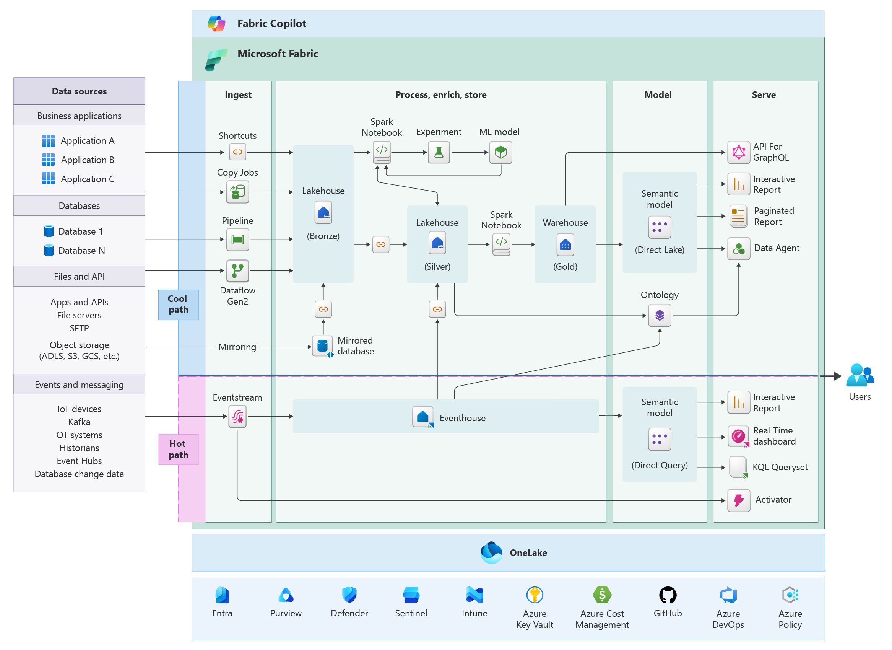
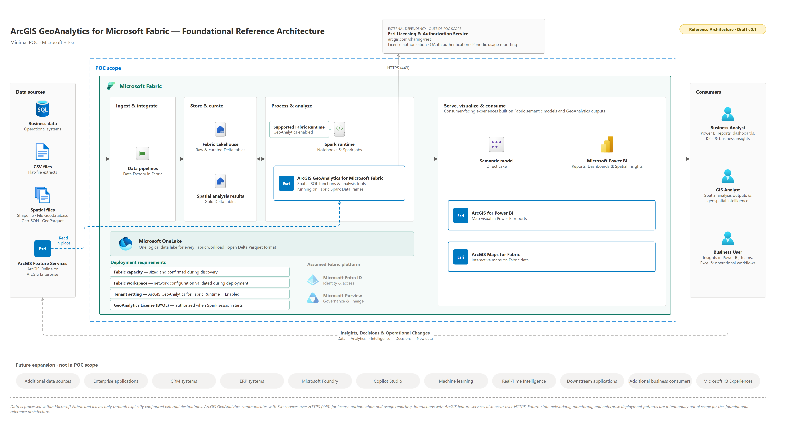

# ArcGIS GeoAnalytics for Microsoft Fabric: Customer Guidance

## Executive Summary

ArcGIS GeoAnalytics for Microsoft Fabric runs distributed spatial analysis inside Microsoft Fabric Spark, so Esri and business data can be enriched where it already lives. This page gives the Fabric foundation, what a customer needs in place to run it, the three stages of the scenario, and how to scope a proof of concept. For the full landscape, see [01 · Microsoft + Esri Foundation](../01-Microsoft-Esri-Foundation/).

---

## Where GeoAnalytics Sits in the Microsoft + Esri Landscape

The Microsoft + Esri landscape is anchored by five integrations. Three run in Microsoft Fabric and Power BI: **ArcGIS GeoAnalytics for Microsoft Fabric**, **ArcGIS Maps for Microsoft Fabric**, and **ArcGIS for Power BI**. Two extend the story: **ArcGIS for Microsoft 365** and **ArcGIS on Microsoft Azure**. The full landscape is described in [01 · Microsoft + Esri Foundation](../01-Microsoft-Esri-Foundation/README.md#microsoft--esri-fabric-integration-landscape).

Within that landscape, GeoAnalytics provides the **spatial processing** step:

| Capability | Role in the landscape | Covered in |
|---|---|---|
| **ArcGIS GeoAnalytics for Microsoft Fabric** | Distributed spatial analysis and enrichment in Fabric Spark | This guide |
| ArcGIS Maps for Microsoft Fabric | Mapping and spatial visualization within Fabric | Planned component 03 |
| ArcGIS for Power BI | Location-aware reporting for business users | Planned component 04 |

These capabilities are related but not interchangeable. GeoAnalytics typically produces the spatially enriched data that the mapping and reporting experiences consume.

---

## Fabric Foundation

GeoAnalytics runs only inside Microsoft Fabric, so every Esri integration in this library starts from a well-designed Fabric workload. Microsoft documents that foundation in the Azure Well-Architected Framework. This library links to that guidance rather than restating it.



**Source:** Microsoft Learn, [Microsoft Fabric workloads, Azure Well-Architected Framework](https://learn.microsoft.com/en-us/azure/well-architected/microsoft-fabric/overview) (SRC-MSFT-016). Microsoft also provides a [Visio file of this architecture](https://arch-center.azureedge.net/fabric-architecture.vsdx).

**Where Esri fits in this architecture:**

| Area of the diagram | Esri role |
|---|---|
| Data sources | ArcGIS Online and ArcGIS Enterprise, copied into OneLake or read in place ([Stage 1](03-Stage-1-Bring-Data-into-Fabric.md)) |
| Process, enrich, store: Spark notebooks | ArcGIS GeoAnalytics runs here and enriches data spatially ([Stage 2](04-Stage-2-Spatial-Processing.md)) |
| Serve | ArcGIS Maps for Microsoft Fabric and ArcGIS for Power BI ([Stage 3](05-Stage-3-Use-the-Results.md)) |
| Outside Fabric (not shown) | ArcGIS service communication over HTTPS (443) ([Stage 2 minimum deployable POC](04-Stage-2-Spatial-Processing.md#architecture)) |

**Fabric design guidance by pillar** (Microsoft Learn). Review these with the customer's platform team before the proof of concept:

| Pillar | Why it matters for GeoAnalytics |
|---|---|
| [Reliability](https://learn.microsoft.com/en-us/azure/well-architected/microsoft-fabric/reliability) | Recovery and availability expectations for Spark jobs and their outputs |
| [Security](https://learn.microsoft.com/en-us/azure/well-architected/microsoft-fabric/security) | Workspace isolation, role-based access, identities, and secure networking |
| [Cost Optimization](https://learn.microsoft.com/en-us/azure/well-architected/microsoft-fabric/cost-optimization) | Capacity sizing; GeoAnalytics also meters Esri core-hours separately |
| [Operational Excellence](https://learn.microsoft.com/en-us/azure/well-architected/microsoft-fabric/operational-excellence) | Deployment pipelines, version control, and monitoring for notebooks and job definitions |
| [Performance Efficiency](https://learn.microsoft.com/en-us/azure/well-architected/microsoft-fabric/performance-efficiency) | Right-sizing capacity and isolating heavy Spark workloads |

One design consideration applies directly: Spark jobs, pipelines, queries, and refreshes draw on the same capacity, so heavy spatial processing can compete with interactive work. Microsoft recommends isolation, scheduling, and workload separation across capacities and workspaces ([Microsoft Learn](https://learn.microsoft.com/en-us/azure/well-architected/microsoft-fabric/overview)).

---

## What You Need to Run GeoAnalytics

GeoAnalytics is not a standalone service. It runs only inside Microsoft Fabric, so a Fabric foundation is the first requirement. The minimum, as published by Microsoft and Esri:

| # | Requirement | What it means | Source |
|---|---|---|---|
| 1 | **Microsoft Fabric capacity and workspace** | A Fabric workspace on a capacity where Spark can run. Published documentation does not state a minimum capacity size; confirm during discovery. | [Microsoft Learn](https://learn.microsoft.com/en-us/fabric/data-engineering/spark-arcgis-geoanalytics) |
| 2 | **Tenant setting enabled** | A Fabric tenant administrator enables *ArcGIS GeoAnalytics for Fabric Runtime* in the Admin Portal. Capacity administrators can override it per capacity. When disabled, the library is unavailable. | [Microsoft Learn](https://learn.microsoft.com/en-us/fabric/data-engineering/spark-arcgis-geoanalytics); [Evidence SEC-001](records/Evidence.md) |
| 3 | **Fabric Runtime 1.3** | GeoAnalytics is enabled only in the Fabric 1.3 runtime. The library is preinstalled and preconfigured; no separate installation. | [Esri FAQ](https://developers.arcgis.com/geoanalytics-fabric/faq/); [Microsoft Learn](https://learn.microsoft.com/en-us/fabric/data-engineering/spark-arcgis-geoanalytics) |
| 4 | **OneLake data** | A Lakehouse or other supported Fabric data source to read input from and write enriched results back to. | [Microsoft Learn](https://learn.microsoft.com/en-us/fabric/data-engineering/spark-arcgis-geoanalytics) |
| 5 | **Spark notebook or Spark job definition** | Where GeoAnalytics code runs (`import geoanalytics_fabric`). | [Esri FAQ](https://developers.arcgis.com/geoanalytics-fabric/faq/) |
| 6 | **GeoAnalytics license** | Bring your own license: an active GeoAnalytics for Microsoft Fabric subscription, authorized with a username and password or an Esri-provided API key. Usage is metered in compute unit-hours (core-hours). | [Microsoft Learn](https://learn.microsoft.com/en-us/fabric/data-engineering/spark-arcgis-geoanalytics); [Esri authorization](https://developers.arcgis.com/geoanalytics-fabric/authorization/) |
| 7 | **Outbound HTTPS to Esri** | Outbound HTTPS on port 443 to arcgis.com for authorization and usage reporting. Not supported when Outbound Access Protection is enabled. | [Evidence SEC-004, SEC-007](records/Evidence.md) |

### Foundational Reference Architecture

Reference Architecture · Draft v0.1. The minimum Microsoft + Esri architecture for a GeoAnalytics proof of concept, built on the [Fabric Foundation](#fabric-foundation) above.



How to read it:

- **Inside the POC scope:** data sources flow through Fabric ingestion, the Lakehouse, and Spark with GeoAnalytics, then to the semantic model, Power BI, ArcGIS for Power BI, and ArcGIS Maps for Fabric.
- **Deployment requirements:** the four tags along the bottom of the Fabric box correspond to requirements 1, 2, and 6 in the table above. The "Supported Fabric Runtime" label refers to requirement 3, Fabric Runtime 1.3.
- **Crossing the boundary:** the solid HTTPS (443) line to the Esri licensing service always occurs (requirement 7). The dashed "read in place" line to ArcGIS feature services occurs only when code requests it.
- **Assumed platform and future expansion:** Microsoft Entra ID and Microsoft Purview are standard Fabric platform services, not GeoAnalytics requirements. Items in the Future expansion row are outside the POC.

The [Stage 2 minimum deployable POC diagram](04-Stage-2-Spatial-Processing.md#architecture) shows these requirements in one view, with the calls that cross the Fabric boundary.

**Platform references:**

- **Fabric foundation:** [Fabric Foundation](#fabric-foundation) above, from the Azure Well-Architected Framework.
- **GeoAnalytics component architecture:** [Architecture.md](Architecture.md) shows how GeoAnalytics sits within Fabric (Fabric, Fabric Runtime, Apache Spark, GeoAnalytics) and its dependencies.

---

## The Three Stages

The scenario moves through three stages. Each stage has its own page with discovery questions, flow, architecture, guidance, and handoff. The [End-to-End Scenario](02-End-to-End-Scenario.md) walks through them in order.

```text
Stage 1 · Bring data into Fabric
  Customer data sources → Fabric ingestion or supported connection → OneLake and Fabric data items

Stage 2 · Spatial processing
  Fabric Spark notebook or Spark job definition → ArcGIS GeoAnalytics → Spatially enriched Spark DataFrame

Stage 3 · Use the results
  Customer-approved Fabric or ArcGIS output → Power BI, ArcGIS Maps for Fabric, or ArcGIS apps
```

| Stage | Outcome | Page |
|---|---|---|
| 1 · Bring data into Fabric | Business and spatial data available in OneLake, copied in or read in place from ArcGIS | [Stage 1](03-Stage-1-Bring-Data-into-Fabric.md) |
| 2 · Spatial processing | GeoAnalytics enriches the data in Fabric Spark | [Stage 2](04-Stage-2-Spatial-Processing.md) |
| 3 · Use the results | Enriched output reviewed in the selected consumption experience | [Stage 3](05-Stage-3-Use-the-Results.md) |

---

## Proof-of-Concept Framework

A proof of concept should begin with a clearly defined business decision or analytical question that requires location context. The architecture should then be reduced to the minimum components required to test that question.

A bounded GeoAnalytics proof of concept should identify:

1. **Business question**  
   The operational, analytical, or planning decision that requires location intelligence.

2. **Authoritative business data**  
   The customer dataset representing the relevant asset, event, customer, transaction, or operational condition.

3. **Authoritative geospatial data**  
   The layers, features, boundaries, files, services, or other spatial sources required to provide location context.

4. **Fabric landing or access point**  
   The approved Fabric location or supported connection through which the required data will be accessed.

5. **Spatial operation**  
   The documented GeoAnalytics function or analysis tool required to answer the business question.

6. **Validated output**  
   The spatially enriched dataset, analytical result, or measurable finding the proof of concept is expected to produce.

7. **Consumption experience**  
   The validated experience through which the output will be reviewed, such as Power BI, an ArcGIS application, ArcGIS Maps for Microsoft Fabric, or an approved Fabric data product.

8. **Success criteria**  
   The measurable result that would demonstrate business value, architectural fit, and technical feasibility.

### Network Readiness Discovery

Confirm the customer's network posture early. GeoAnalytics calls Esri services outside Fabric for authentication and usage tracking, and is currently not supported when Outbound Access Protection is enabled ([Evidence SEC-004](records/Evidence.md)). Esri confirms these calls use HTTPS on port 443 to the arcgis.com domain, and that notebook plotting with a basemap also retrieves tiles from Esri ([Evidence SEC-007 to SEC-009](records/Evidence.md)). Behavior with managed virtual networks or Private Link is not yet documented ([Evidence GAP-003](records/Evidence.md#open-evidence-gaps)).

- [ ] Is Outbound Access Protection enabled, or planned, for the target Fabric workspace?
- [ ] Is outbound internet access from Fabric Spark restricted by customer firewall or proxy policy?
- [ ] Does the customer require endpoint or hostname allow-listing for outbound connections? If so, allow outbound HTTPS on port 443 to arcgis.com. *(SEC-007)*
- [ ] Does the target workspace use managed virtual networks or Private Link? *(Open: GeoAnalytics behavior not yet documented, GAP-003)*
- [ ] Has the customer's network or security team been engaged to review these requirements before the proof of concept?

If any answer indicates restricted outbound access, raise it as a proof-of-concept risk and escalate to Esri and Microsoft for confirmation before committing to a design.

The objective is not to demonstrate every Microsoft and Esri integration in a single exercise. The objective is to validate a focused and repeatable pattern that can inform a production design.

---

## Scope and Boundaries

This guide describes the documented current-state relationship between Microsoft Fabric and ArcGIS GeoAnalytics for Microsoft Fabric. It does not claim that:

- Every ArcGIS product, service, or data model runs within Microsoft Fabric.
- ArcGIS GeoAnalytics replaces ArcGIS applications or operational GIS systems.
- ArcGIS Online or ArcGIS Enterprise data automatically synchronizes with OneLake.
- ArcGIS Maps for Microsoft Fabric and ArcGIS for Power BI are interchangeable.
- A spatially enriched Fabric dataset is automatically available to copilots or agents.
- GeoIQ, ArcGIS MCP, Microsoft Foundry, or agentic integrations are included in the current GeoAnalytics product architecture.

Agentic, GeoIQ, and MCP integration concepts should be documented separately as reference patterns until their product behavior, identity model, security boundaries, and supported integration paths are validated.

---

## Supporting Technical Records

- [End-to-end scenario walkthrough](02-End-to-End-Scenario.md)
- [Component architecture](Architecture.md)
- [Evidence register](records/Evidence.md)
- [Source register](records/Source-Register.md)
