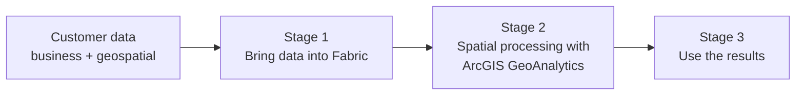

# ArcGIS GeoAnalytics for Microsoft Fabric: End-to-End Scenario

## Overview

The [Customer Guidance](01-Customer-Guidance.md) page explains **where** ArcGIS GeoAnalytics fits within Microsoft Fabric. This page explains **how** a customer moves through that fit, step by step: from customer data, through spatial processing, to a validated output.

The scenario follows the architectural relationship already established in the Customer Guidance:

```text
Customer Data Sources → Fabric ingestion or supported connection → OneLake and Fabric data items
→ Fabric Spark notebook or Spark job definition → ArcGIS GeoAnalytics
→ Spatially enriched Spark DataFrame → Customer-approved Fabric or ArcGIS output
```

The walkthrough is organized into three stages, each on its own page. Every stage page uses the same structure:

| Section | Purpose |
|---|---|
| **Purpose** | What the customer accomplishes in this stage |
| **Discovery Questions** | What to ask the customer before designing the stage (where applicable) |
| **Flow** | What happens, in order |
| **Architecture** | The relevant reference architecture or scenario view |
| **Guidance** | Where to find setup and implementation detail |
| **Handoff** | What this stage produces and the next stage consumes |

> **Architecture labeling**
>
> - **Microsoft reference** — published by Microsoft and linked to the source.
> - **Esri reference** — published by Esri and linked to the source.
> - **Scenario view** — adapted for this repository to explain the customer workflow. Not a Microsoft- or Esri-published architecture.
>
> Every claim and connection in a scenario view should be traceable to the [Evidence register](records/Evidence.md) and [Source register](records/Source-Register.md).

---

## The Scenario at a Glance



| Stage | Customer question | Stage output |
|---|---|---|
| [1. Bring data into Fabric](03-Stage-1-Bring-Data-into-Fabric.md) | "We have data. How does it get into Fabric?" | Business and geospatial data available as OneLake and Fabric data items |
| [2. Spatial processing with GeoAnalytics](04-Stage-2-Spatial-Processing.md) | "Once it is in Fabric, how does spatial analysis work?" | A spatially enriched Spark DataFrame, persisted to an approved location |
| [3. Use the results](05-Stage-3-Use-the-Results.md) | "What can we do with the output?" | A validated consumption experience for the business question |

**Example business question (replace per customer):** *Which assets are located within a defined distance of a risk area, and how does exposure vary by region?*

---

## Start the Walkthrough

**[Begin with Stage 1: Bring Data into Fabric →](03-Stage-1-Bring-Data-into-Fabric.md)**

---

## Scenario Variants

The primary path in Stages 1–3 uses batch data in a lakehouse. Variants should be documented as separate pages, reusing this structure.

| Variant | What changes | Status |
|---|---|---|
| Streaming or event data | Stage 1 uses Eventstream; Stage 2 processing approach requires validation | To be validated |
| ArcGIS-sourced geospatial data | Stage 1 reads from an ArcGIS source using a documented path | To be validated |
| Scheduled production processing | Stage 2 uses a Spark job definition orchestrated by a pipeline | To be validated |

---

## Related Pages

- [Stage 1: Bring Data into Fabric](03-Stage-1-Bring-Data-into-Fabric.md)
- [Stage 2: Spatial Processing](04-Stage-2-Spatial-Processing.md)
- [Stage 3: Use the Results](05-Stage-3-Use-the-Results.md)
- [Customer Guidance](01-Customer-Guidance.md) — landscape, platform fit, and proof-of-concept framework
- [Component architecture](Architecture.md)
- [Evidence register](records/Evidence.md)
- [Source register](records/Source-Register.md)
