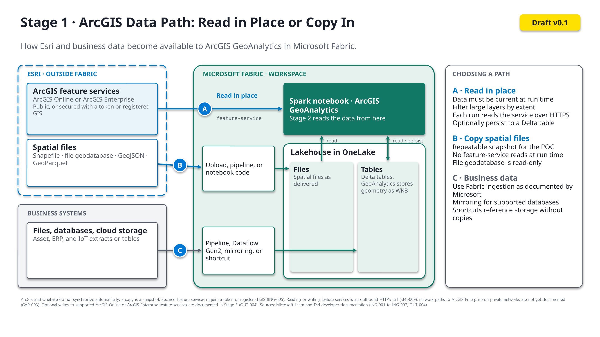

# Stage 1: Bring Data into Fabric

> ArcGIS GeoAnalytics for Microsoft Fabric · Part of the [End-to-End Scenario](02-End-to-End-Scenario.md) · Stage 1 of 3

[← End-to-End Scenario overview](02-End-to-End-Scenario.md) | [Stage 2: Spatial Processing →](04-Stage-2-Spatial-Processing.md)

---

## Purpose

Make the authoritative business data and authoritative geospatial data identified in the [Proof-of-Concept Framework](01-Customer-Guidance.md#proof-of-concept-framework) available to Fabric Spark.

## Flow

1. **Identify the sources.** Separate the business data (assets, events, customers, transactions) from the geospatial data (layers, boundaries, files, services).
2. **Select the landing or access point.** Choose an approved Fabric ingestion method or supported connection for each source.
3. **Land the data in OneLake.** Store data as Fabric data items, typically lakehouse tables or files.
4. **Prepare for spatial processing.** Confirm that each dataset contains usable location information, such as coordinates or geometry, and document the coordinate system.

## Discovery Questions

Ask these before selecting an ingestion path. Each answer narrows the options in the table below.

**Sources and ownership**

- [ ] What business question does this data support? *(Proof-of-Concept Framework, step 1)*
- [ ] Which datasets are authoritative for the business data, and which for the geospatial data?
- [ ] Who owns each source, and has the customer approved access for this proof of concept?

**Source type and location**

- [ ] Is each source a file, an operational database, existing cloud storage, a stream, or an ArcGIS feature service?
- [ ] For databases: is the source supported by Fabric Mirroring? *(ING-003)*
- [ ] For cloud storage: can the data stay in place and be referenced through a OneLake shortcut, or must it be copied? *(ING-002)*
- [ ] For streaming data: is real-time processing required, or is batch acceptable for the proof of concept? *(Streaming is a separate scenario variant)*

**Spatial formats and location fields**

- [ ] In what format is the geospatial data delivered (shapefile, file geodatabase, GeoJSON, GeoParquet, CSV, Parquet)? Is each format readable by GeoAnalytics? *(ING-004)*
- [ ] Will results need to be written back in the same format? File geodatabase is read-only in GeoAnalytics. *(ING-004)*
- [ ] Does each dataset contain coordinates, addresses, or geometry? Which fields hold location?
- [ ] What coordinate system was each dataset collected in, and is it documented? *(ING-007)*
- [ ] Are there join keys between the business and geospatial data, or will the relationship be spatial?

**ArcGIS-hosted data**

- [ ] Is any data hosted in ArcGIS Online or ArcGIS Enterprise feature services? *(ING-005)*
- [ ] Are those services public or secured? If secured, will access use a registered GIS or a token? *(ING-005)*
- [ ] Should feature-service data be read directly in Stage 2, or persisted to the lakehouse first?

**Volume and frequency**

- [ ] What is the approximate data volume and row count for each source?
- [ ] Is this a one-time load for the proof of concept, or a recurring refresh?

**Network and security**

- [ ] Has the [Network Readiness Discovery](01-Customer-Guidance.md#network-readiness-discovery) checklist been completed? Outbound restrictions affect both GeoAnalytics authorization and feature-service access. *(SEC-004, GAP-003)*

## Selecting an Ingestion Path

The Microsoft reference architecture describes multiple ingestion patterns. Select the one matching the customer source, rather than documenting every option. Start with Microsoft's [Options to get data into the lakehouse](https://learn.microsoft.com/en-us/fabric/data-engineering/load-data-lakehouse) and [Choose a data movement strategy](https://learn.microsoft.com/en-us/fabric/data-factory/decision-guide-data-movement) decision guide.

| Customer source | Candidate Fabric pattern | Reference | Validation note |
|---|---|---|---|
| Files or batch extracts | Data pipeline (Copy activity) or Dataflow Gen2 into a lakehouse | [Copy activity](https://learn.microsoft.com/en-us/fabric/data-factory/copy-data-activity) · [Dataflow Gen2](https://learn.microsoft.com/en-us/fabric/data-factory/dataflows-gen2-overview) | Confirm file formats required by the scenario |
| Spatial files (shapefile, file geodatabase, GeoJSON, GeoParquet) | Land the files in the lakehouse **Files** area; read them with GeoAnalytics in Stage 2 | [GeoAnalytics data sources](https://developers.arcgis.com/geoanalytics-fabric/data/data-sources/) | File geodatabase is read-only in GeoAnalytics |
| Operational databases | Mirroring, where supported, or a data pipeline | [Mirroring](https://learn.microsoft.com/en-us/fabric/mirroring/overview) | Confirm source support |
| Existing cloud storage | OneLake shortcut | [OneLake shortcuts](https://learn.microsoft.com/en-us/fabric/onelake/onelake-shortcuts) | Confirm storage type and access model; avoids data copies (optional caching available) |
| Streaming or event data | Eventstream | [Eventstreams overview](https://learn.microsoft.com/en-us/fabric/real-time-intelligence/event-streams/overview) | Treat as a separate scenario variant |
| ArcGIS Online or ArcGIS Enterprise feature services | Read directly into a Spark DataFrame with GeoAnalytics in Stage 2; optionally persist to the lakehouse | [Feature service data source](https://developers.arcgis.com/geoanalytics-fabric/data/data-sources/feature-service/) | Secured services require a registered GIS or a token; do not assume automatic synchronization with OneLake |

## Architecture

**Microsoft reference:** the ingest and store portions of the [Fabric Foundation](01-Customer-Guidance.md#fabric-foundation) architecture from the Azure Well-Architected Framework.

**ArcGIS data path (v0.1):**

[Open the full-size diagram](images/stage-1-arcgis-data-path.png)

The diagram's reference to writing results back to ArcGIS means an explicit write to a supported ArcGIS Online or ArcGIS Enterprise feature service. [Stage 3](05-Stage-3-Use-the-Results.md) documents this optional output path (OUT-004); it does not imply automatic synchronization or support for every ArcGIS destination.

Three documented paths make data available to GeoAnalytics:

- **A · Read in place:** GeoAnalytics reads ArcGIS Online or ArcGIS Enterprise feature services directly into a Spark DataFrame, optionally persisting the result to a Delta table (ING-005).
- **B · Copy spatial files:** shapefile, file geodatabase, GeoJSON, or GeoParquet files land in the lakehouse Files area (ING-001, ING-004).
- **C · Business data:** Microsoft-documented Fabric ingestion into lakehouse tables (ING-001 to ING-003).

ArcGIS and OneLake do not synchronize automatically, so a copy is a snapshot. Reading feature services is an outbound HTTPS call (SEC-009); GeoAnalytics licensing and usage calls occur on every path ([Stage 2](04-Stage-2-Spatial-Processing.md#architecture)). Mirroring or shortcuts pointed directly at an ArcGIS Enterprise geodatabase are not drawn because they are not yet validated.

## Guidance

- Lakehouse concepts → [What is a lakehouse?](https://learn.microsoft.com/en-us/fabric/data-engineering/lakehouse-overview)
- Lakehouse creation → [Create a lakehouse](https://learn.microsoft.com/en-us/fabric/data-engineering/create-lakehouse)
- Layering raw, cleansed, and curated data → [Medallion lakehouse architecture in Fabric](https://learn.microsoft.com/en-us/fabric/onelake/onelake-medallion-lakehouse-architecture)
- Ingestion options → [Options to get data into the lakehouse](https://learn.microsoft.com/en-us/fabric/data-engineering/load-data-lakehouse)
- GeoAnalytics in Fabric (Microsoft) → [ArcGIS GeoAnalytics for Microsoft Fabric](https://learn.microsoft.com/en-us/fabric/data-engineering/spark-arcgis-geoanalytics)
- Data readiness checklist:
  - [ ] Location fields identified (coordinates, addresses, or geometry)
  - [ ] Coordinate system documented ([coordinate systems guidance](https://developers.arcgis.com/geoanalytics-fabric/core-concepts/coordinate-systems/))
  - [ ] Spatial file formats confirmed against [GeoAnalytics data sources](https://developers.arcgis.com/geoanalytics-fabric/data/data-sources/)
  - [ ] Geometry written to Delta tables by GeoAnalytics is stored as WKB; in Stage 2, check the column type and convert back with functions such as `ST_GeomFromBinary` ([Microsoft Learn](https://learn.microsoft.com/en-us/fabric/data-engineering/spark-arcgis-geoanalytics))
  - [ ] Join keys between business and geospatial data identified
  - [ ] Data access approved by the customer

## Handoff

**Stage 1 produces** business and geospatial data available as OneLake and Fabric data items.
**Stage 2 consumes** those items from a Fabric Spark notebook or Spark job definition.

---

[← End-to-End Scenario overview](02-End-to-End-Scenario.md) | [Stage 2: Spatial Processing →](04-Stage-2-Spatial-Processing.md)
