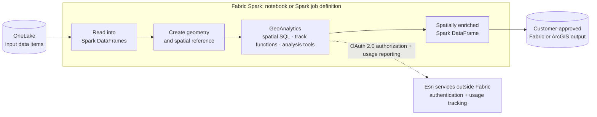

# Stage 2: Spatial Processing with ArcGIS GeoAnalytics

> ArcGIS GeoAnalytics for Microsoft Fabric · Part of the [End-to-End Scenario](02-End-to-End-Scenario.md) · Stage 2 of 3

[← Stage 1: Bring Data into Fabric](03-Stage-1-Bring-Data-into-Fabric.md) | [Stage 3: Use the Results →](05-Stage-3-Use-the-Results.md)

---

## Purpose

Apply the spatial operation required to answer the business question, using ArcGIS GeoAnalytics within the Fabric Spark environment.

## Flow

1. **Open the processing environment.** Use a Fabric Spark notebook for interactive development or a Spark job definition for repeatable execution.
2. **Make GeoAnalytics available and authorize it.** Follow the documented Esri setup and authorization steps.
3. **Read the data.** Load the Stage 1 data into Spark DataFrames.
4. **Create geometry.** Construct geometry from location fields and set the spatial reference.
5. **Apply the spatial operation.** Use the documented capability that fits the question:
   - **Spatial SQL functions** for geometry operations and relationships
   - **Track functions** for movement and time-sequenced location data
   - **Analysis tools** for higher-level spatial analysis
6. **Produce the result.** The output is a spatially enriched Spark DataFrame.
7. **Persist the result.** Write the output to a customer-approved Fabric or ArcGIS location.

## Architecture

**Esri reference:** *Add the Esri documentation link for ArcGIS GeoAnalytics for Microsoft Fabric and record it in the Source register.*

**Component relationship** (from the Customer Guidance):

```text
Microsoft Fabric
    └── Fabric Runtime
          └── Apache Spark
                └── ArcGIS GeoAnalytics
```

**Scenario view:**



> **Validated external calls (see [Evidence register](records/Evidence.md)):**
>
> - GeoAnalytics calls Esri services outside Fabric for authentication and usage tracking, and is currently **not supported when Outbound Access Protection is enabled** (SEC-004).
> - Processed data stays in the Fabric environment unless the user explicitly writes to an external destination, such as an Esri-hosted feature service (SEC-005).
> - Store credentials in Azure Key Vault and retrieve them with `notebookutils.credentials.getSecret` (SEC-003).
>
> **Still open:** specific Esri endpoints and network requirements (GAP-003). Draw only the connections recorded in the Evidence register.

## Guidance

- GeoAnalytics setup and authorization → *add Esri link*
- Function and tool reference → *add Esri link*
- Component detail → [Architecture.md](Architecture.md)
- Execution considerations:
  - [ ] Notebook for development; Spark job definition for scheduled or repeatable runs
  - [ ] Filter data before spatial operations where possible
  - [ ] Use a consistent spatial reference across inputs
  - [ ] Record the selected function or tool and its parameters for reproducibility

## Handoff

**Stage 2 produces** a spatially enriched dataset persisted to an approved location.
**Stage 3 consumes** that dataset through the selected consumption experience.

---

[← Stage 1: Bring Data into Fabric](03-Stage-1-Bring-Data-into-Fabric.md) | [Stage 3: Use the Results →](05-Stage-3-Use-the-Results.md)
