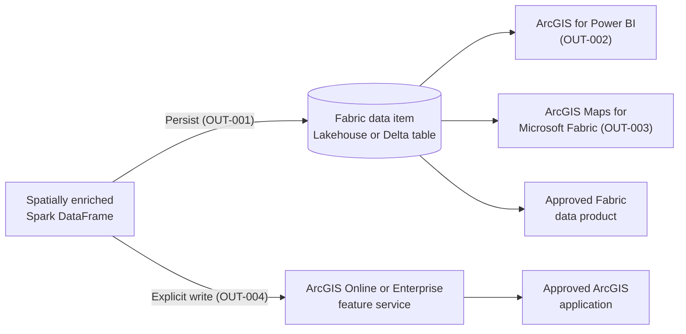

# Stage 3: Use the Results

> ArcGIS GeoAnalytics for Microsoft Fabric · Part of the [End-to-End Scenario](02-End-to-End-Scenario.md) · Stage 3 of 3

[← Stage 2: Spatial Processing](04-Stage-2-Spatial-Processing.md) | [Back to End-to-End Scenario overview →](02-End-to-End-Scenario.md)

---

## Purpose

Deliver the spatially enriched output through the experience that best answers the business question.

## Flow

1. **Confirm the output.** Identify whether the enriched result is a Spark DataFrame, a Fabric lakehouse or Delta table, or a supported ArcGIS feature service.
2. **Persist the result.** Write the DataFrame to a supported Fabric data item, or explicitly write it to an ArcGIS Online or ArcGIS Enterprise feature service.
3. **Select the consumption experience.** Choose based on the audience and the business question.
4. **Validate access and refresh behavior.** Confirm identity, permissions, network access, and how reruns replace, append, or update the output.
5. **Measure against success criteria.** Confirm the output answers the business question defined in the proof of concept.

## Selecting a Consumption Experience

As noted in the Customer Guidance, these experiences are related but **not interchangeable**.

| Audience and need | Experience | Supported path | Evidence |
|---|---|---|---|
| Business users who need location-aware reporting | **ArcGIS for Power BI** | Expose the Fabric output through a Power BI semantic model or report, then add the ArcGIS visual | OUT-002 |
| Fabric users who need map-based exploration | **ArcGIS Maps for Microsoft Fabric** | Load the supported Fabric or OneLake output through the documented Maps for Fabric workflow | OUT-003 |
| GIS users and operational applications | **ArcGIS Online or ArcGIS Enterprise application** | Explicitly write the supported DataFrame to a feature service, then consume that service in the approved ArcGIS application | OUT-004 |
| Data teams building further analytics | **Approved Fabric data product** | Persist the output to a supported Fabric data item for downstream workloads | OUT-001 |
| AI or agent scenarios | **Separately validated reference pattern** | Validate separately; this path is outside the current GeoAnalytics architecture | [Scope and Boundaries](01-Customer-Guidance.md#scope-and-boundaries) |

## Architecture

**Microsoft reference:** the serve portion of the [Fabric Foundation](01-Customer-Guidance.md#fabric-foundation) architecture from the Azure Well-Architected Framework.

**Scenario view:**

## Guidance

- Use [Create ArcGIS Maps for Power BI](https://learn.microsoft.com/en-us/power-bi/visuals/power-bi-visualization-arcgis) and Esri's [ArcGIS for Power BI introduction](https://doc.arcgis.com/en/power-bi/get-started/introduction.htm) for Power BI reports.
- Use the [ArcGIS for Microsoft Fabric product documentation](https://www.esri.com/en-us/arcgis/products/arcgis-for-microsoft/arcgis-for-microsoft-fabric) and [ArcGIS Maps for Microsoft Fabric quick start guide](https://www.esri.com/content/dam/esrisites/en-us/media/pdf/implementation-guides/maps-for-fabric-quick-start-guide.pdf) for map-based exploration in Fabric.
- Use the GeoAnalytics [feature service data source](https://developers.arcgis.com/geoanalytics-fabric/data/data-sources/feature-service/) guidance to explicitly write supported results to ArcGIS Online or ArcGIS Enterprise.

Writing to a feature service is an explicit outbound operation initiated by customer code. It is not automatic synchronization between ArcGIS and OneLake. Validate ArcGIS authorization, service capabilities, create or update permissions, and customer network policy before selecting this path (OUT-004, SEC-005, SEC-009).

### Validation Checklist

- [ ] The intended audience can access the selected experience.
- [ ] The expected records, location fields, and geometry are present.
- [ ] Power BI, Fabric, and ArcGIS identities and permissions are approved.
- [ ] Refresh or rerun behavior is defined as replace, append, or update.
- [ ] External feature-service writes are permitted by customer network policy.
- [ ] Sharing does not grant broader access than the proof of concept requires.
- [ ] The experience satisfies the proof-of-concept success criteria.

## Definition of a Validated Consumption Experience

A consumption experience is validated when the documented path is configured, the intended audience can access it, the expected spatial output is present, and refresh or publication behavior has been tested against the proof-of-concept success criteria.

## Handoff

**Stage 3 produces** a validated customer outcome through an evidence-backed consumption path. Results inform the production design or the next iteration of the scenario.

---

[← Stage 2: Spatial Processing](04-Stage-2-Spatial-Processing.md) | [Back to End-to-End Scenario overview →](02-End-to-End-Scenario.md)
