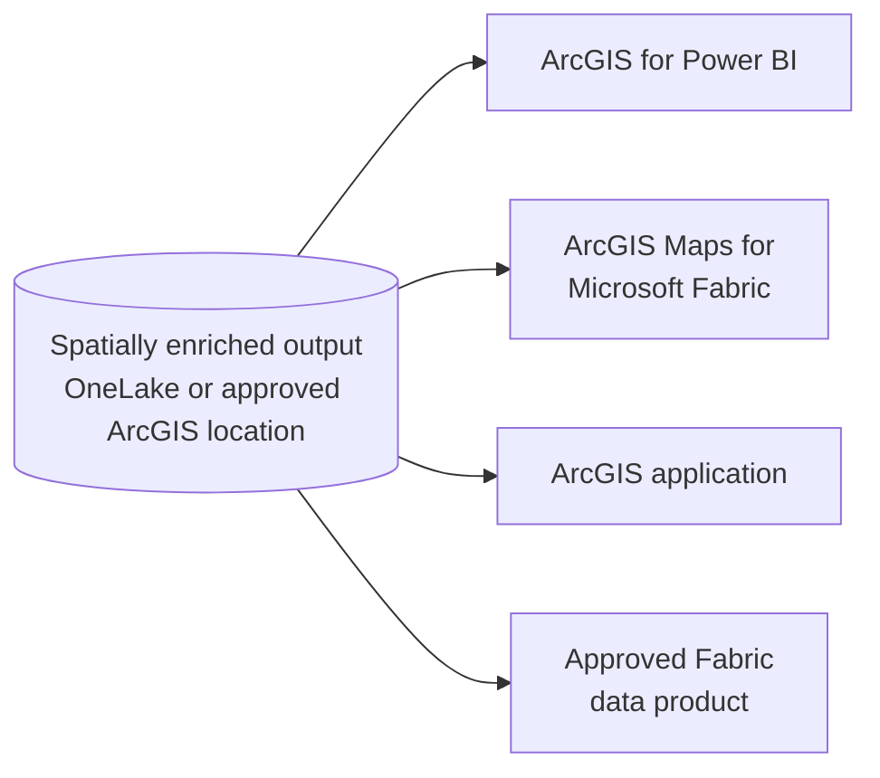

# Stage 3: Use the Results

> ArcGIS GeoAnalytics for Microsoft Fabric · Part of the [End-to-End Scenario](02-End-to-End-Scenario.md) · Stage 3 of 3

[← Stage 2: Spatial Processing](04-Stage-2-Spatial-Processing.md) | [Back to End-to-End Scenario overview →](02-End-to-End-Scenario.md)

---

## Purpose

Deliver the spatially enriched output through the experience that best answers the business question.

## Flow

1. **Confirm where the output lives.** Typically a lakehouse table in OneLake, or an approved ArcGIS location.
2. **Select the consumption experience.** Choose based on the audience and the question.
3. **Validate access and security.** Confirm who can view the output and through which experience.
4. **Measure against success criteria.** Confirm the output answers the business question defined in the proof of concept.

## Selecting a Consumption Experience

As noted in the Customer Guidance, these experiences are related but **not interchangeable**.

| Audience and need | Experience | Role |
|---|---|---|
| Business users who need location-aware reporting | **ArcGIS for Power BI** | Location-aware visualization and analysis within Power BI reports |
| Fabric users who need map-based exploration | **ArcGIS Maps for Microsoft Fabric** | Mapping and spatial visualization within Fabric experiences |
| GIS users and operational applications | **ArcGIS application** | Use of the output within approved ArcGIS experiences |
| Data teams building further analytics | **Approved Fabric data product** | Reuse of the enriched data across Fabric workloads |
| AI or agent scenarios | **Separately validated reference pattern** | Not part of the current GeoAnalytics architecture; see [Scope and Boundaries](01-Customer-Guidance.md#scope-and-boundaries) |

## Architecture

**Microsoft reference:** the serve portion of the [Fabric Foundation](01-Customer-Guidance.md#fabric-foundation) architecture from the Azure Well-Architected Framework.

**Scenario view:**

## Guidance

- ArcGIS for Power BI → *add Esri/Microsoft link*
- ArcGIS Maps for Microsoft Fabric → *add link*
- Publishing or sharing to ArcGIS → *add Esri link; confirm the supported path*

## Handoff

**Stage 3 produces** a validated customer outcome measured against the proof-of-concept success criteria. Results inform the production design or the next iteration of the scenario.

---

[← Stage 2: Spatial Processing](04-Stage-2-Spatial-Processing.md) | [Back to End-to-End Scenario overview →](02-End-to-End-Scenario.md)
