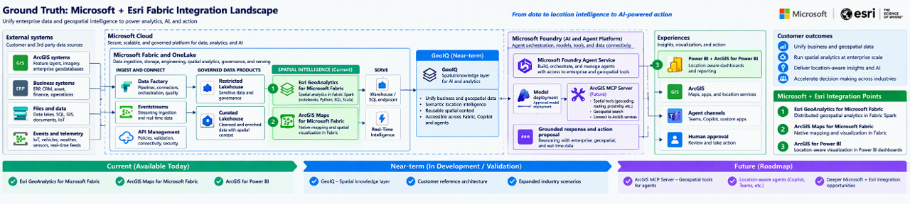
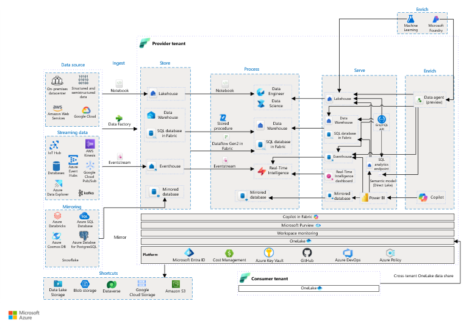

# Customer Guidance: ArcGIS GeoAnalytics for Microsoft Fabric

## Purpose

This guide explains where ArcGIS GeoAnalytics for Microsoft Fabric fits within the broader Microsoft \+ Esri architecture and how the component can inform discovery, architecture discussions, and an initial proof of concept.

The intent is to move from the strategic Microsoft \+ Esri story into the documented Fabric and GeoAnalytics components without presenting roadmap concepts as currently available product integrations.

---

## The Strategic Story

The starting point is not a standalone GIS workload. The opportunity is to bring enterprise business data and geospatial data into a shared analytics foundation so that location becomes part of the customer’s broader data, analytics, and AI strategy.

The Microsoft \+ Esri architecture illustrates that progression:

1. Connect business, operational, and geospatial data.
2. Govern and prepare data within Microsoft Fabric and OneLake.
3. Apply ArcGIS GeoAnalytics within Fabric Spark for distributed spatial processing.
4. deliver mapping and location\-aware analytics through ArcGIS Maps for Microsoft Fabric, ArcGIS for Power BI, and other validated consumption experiences.
5. Establish curated, spatially enriched data products that can support future analytics and AI scenarios.

This is the strategic view. It explains why the Microsoft and Esri integrations matter together.


**Narrative guidance:** Microsoft Fabric provides the enterprise data and analytics foundation. Esri adds spatial analytics, mapping, and location intelligence to that foundation. The current integration story is anchored in three available capabilities: ArcGIS GeoAnalytics for Microsoft Fabric, ArcGIS Maps for Microsoft Fabric, and ArcGIS for Power BI.

---

## Where GeoAnalytics Fits in Microsoft Fabric

The Microsoft + Esri Integration Landscape provides a simplified solution view of how Microsoft and Esri capabilities work together.

The Microsoft Fabric end-to-end analytics architecture provides the underlying platform view. It shows how Fabric ingests, stores, processes, enriches, governs, and serves enterprise data products.

Within that architecture, ArcGIS GeoAnalytics participates in the **Process** layer of the data lifecycle. GeoAnalytics operates through documented Fabric Spark notebooks and Spark job definitions, allowing spatial analytics to execute directly within the Fabric analytics environment.



**Source:** Analytics End-to-End with Microsoft Fabric, Microsoft Learn. See the authoritative architecture guidance here:

[Analytics End-to-End with Microsoft Fabric](https://learn.microsoft.com/en-us/azure/architecture/example-scenario/dataplate2e/data-platform-end-to-end) 【1-eb1424】

The relevant path for ArcGIS GeoAnalytics is:

```text
Customer Data Sources
        ↓
OneLake
        ↓
Fabric Runtime
        ↓
Apache Spark
        ↓
ArcGIS GeoAnalytics
        ↓
Spatially Enriched Data Products
        ↓
Maps, Analytics, Reporting, and AI Experiences
```

The relevant path is:

Customer data sources

        ↓

Fabric ingestion or supported connection

        ↓

OneLake and Fabric data items

        ↓

Fabric Spark notebook or Spark job definition

        ↓

ArcGIS GeoAnalytics

        ↓

Spatially enriched Spark DataFrame

        ↓

Customer\-approved Fabric or ArcGIS output

GeoAnalytics should not be represented as a separate Microsoft Fabric service or an independent compute platform. The documented architectural relationship is:

Microsoft Fabric

    └── Fabric Runtime

          └── Apache Spark

                └── ArcGIS GeoAnalytics

ArcGIS GeoAnalytics adds documented spatial SQL functions, track functions, and analysis tools to the Fabric Spark workflow.

---

## How to Explain the Two Architecture Views

The two diagrams answer different customer questions.

### Microsoft \+ Esri strategic architecture

Use this view when the customer asks:

- Why should Microsoft Fabric and Esri be considered together?
- Where do geospatial analytics and mapping fit in the enterprise data strategy?
- What Microsoft \+ Esri capabilities are available today?
- How could the current data foundation support future analytics and AI scenarios?

This is the strategic and solution\-level conversation.

### Microsoft Fabric end\-to\-end architecture

Use this view when the customer asks:

- How does Microsoft Fabric work?
- Where is data stored and processed?
- Where does GeoAnalytics execute?
- Which Fabric workload is involved?
- How do spatially enriched results re\-enter the governed analytics workflow?

This is the platform and technical architecture conversation.

The Microsoft \+ Esri view should lead into the Microsoft Fabric view. The Fabric view provides the technical depth underneath the strategic story.

---

## Current Integration Baseline

The current Microsoft \+ Esri Fabric story should be anchored in three distinct capabilities.

### 1\. ArcGIS GeoAnalytics for Microsoft Fabric

**Role:** Distributed spatial processing within Fabric Spark.

**Customer question answered:** How can the customer apply geospatial analysis to data being processed in Fabric?

### 2\. ArcGIS Maps for Microsoft Fabric

**Role:** Mapping and spatial visualization within the Microsoft Fabric experience.

**Customer question answered:** How can Fabric users explore and visualize data using location?

### 3\. ArcGIS for Power BI

**Role:** Location\-aware visualization and analysis within Power BI reports.

**Customer question answered:** How can business users consume location intelligence through existing reporting experiences?

These capabilities are related, but they should not be presented as interchangeable. Each capability answers a different architecture and user\-experience question.

---

## POC Guidance

A customer POC should begin with a specific business decision or analytical question that requires spatial context. The architecture should then be reduced to the minimum components required to test that question.

A bounded GeoAnalytics POC should identify:

1. **Business question**

What operational, analytical, or planning decision requires location intelligence?

1. **Authoritative business data**

Which customer dataset represents the business event, asset, customer, transaction, or operational condition?

1. **Authoritative geospatial data**

Which layers, features, boundaries, networks, imagery, or other spatial sources provide the required location context?

1. **Fabric landing point**

Where will the required data be accessed or stored within the customer’s approved Fabric design?

1. **Spatial operation**

Which documented GeoAnalytics function or analysis tool is required to answer the business question?

1. **Validated output**

What spatially enriched dataset or measurable result should the POC produce?

1. **Consumption experience**

Will the result be reviewed through Power BI, ArcGIS, ArcGIS Maps for Microsoft Fabric, a Fabric data product, or another separately validated experience?

1. **Success criteria**

What result would demonstrate that the pattern is useful, technically feasible, and worth advancing?

---

## Recommended Customer Dialogue

### Executive opening

The current Microsoft \+ Esri Fabric integrations create a path for customers to bring business and geospatial data into a shared analytics strategy. Fabric provides the governed data and analytics foundation, while Esri adds spatial processing, mapping, and location\-aware visualization. The immediate opportunity is to identify one decision or workflow where adding location context produces a measurable improvement.

### Architecture transition

The simplified Microsoft \+ Esri architecture explains how the capabilities fit together. If we go one level deeper, the Microsoft Fabric architecture shows where each capability participates in the data lifecycle. GeoAnalytics operates through Fabric Spark in the processing layer, while Maps for Fabric and ArcGIS for Power BI provide distinct visualization and consumption experiences.

### POC transition

Rather than beginning with every possible integration, we should select one business question, one business dataset, one geospatial dataset, and one documented spatial operation. That gives us a bounded POC that can validate the architecture, data readiness, authorization requirements, and customer value without overcommitting to a larger solution design.

---

## Boundaries

This guide does not claim that:

- Every ArcGIS product or data model runs within Microsoft Fabric.
- ArcGIS GeoAnalytics replaces ArcGIS applications or operational GIS systems.
- ArcGIS Online or ArcGIS Enterprise data automatically synchronizes with OneLake.
- ArcGIS Maps for Microsoft Fabric and ArcGIS for Power BI are interchangeable.
- A spatially enriched Fabric dataset is automatically available to copilots or agents.
- GeoIQ, ArcGIS MCP, Microsoft Foundry, or agentic integrations are included in the current GeoAnalytics product architecture.

Agentic and GeoIQ concepts should be maintained as separately labeled reference patterns until the required integrations, security model, and supported product behavior are validated.

---

## Supporting Technical Records

- [Component architecture](https://cr.m365copilotapp.svc.cloud.microsoft/hwav2/chat/conversation/Architecture.md)
- [Evidence register](https://cr.m365copilotapp.svc.cloud.microsoft/hwav2/chat/conversation/Evidence.md)
- [Source register](https://cr.m365copilotapp.svc.cloud.microsoft/hwav2/chat/conversation/Source-Register.md)

