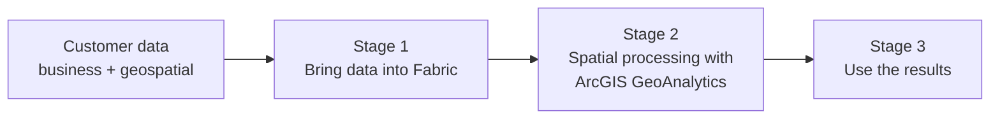
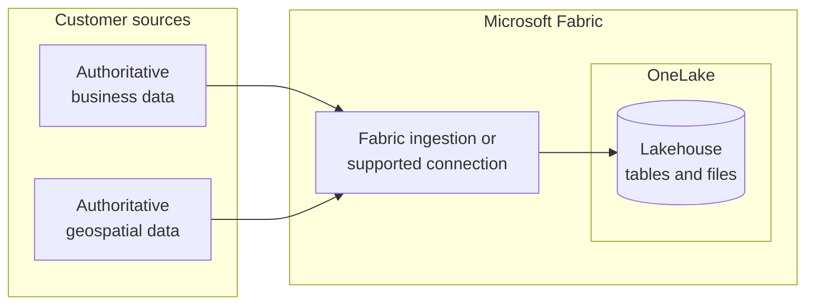
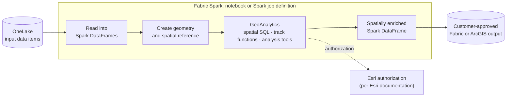
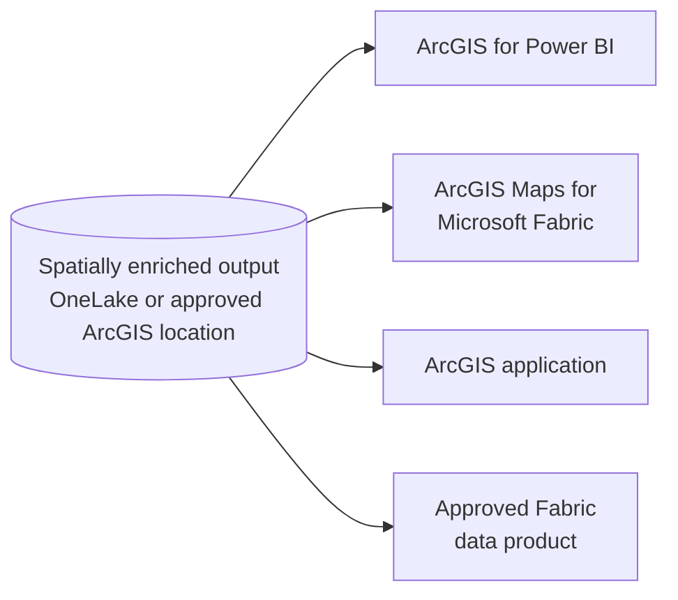

# ArcGIS GeoAnalytics for Microsoft Fabric: End-to-End Scenario

## Overview

The [Customer Guidance](Customer-Guidance.md) page explains **where** ArcGIS GeoAnalytics fits within Microsoft Fabric. This page explains **how** a customer moves through that fit, step by step: from customer data, through spatial processing, to a validated output.

The scenario follows the architectural relationship already established in the Customer Guidance:

```text
Customer Data Sources → Fabric ingestion or supported connection → OneLake and Fabric data items
→ Fabric Spark notebook or Spark job definition → ArcGIS GeoAnalytics
→ Spatially enriched Spark DataFrame → Customer-approved Fabric or ArcGIS output
```

The walkthrough is organized into three stages. Each stage uses the same structure:

| Section | Purpose |
|---|---|
| **Purpose** | What the customer accomplishes in this stage |
| **Flow** | What happens, in order |
| **Architecture** | The relevant reference architecture or scenario view |
| **Guidance** | Where to find setup and implementation detail |
| **Handoff** | What this stage produces and the next stage consumes |

> **Architecture labeling**
>
> - **Microsoft reference** — published by Microsoft and linked to the source.
> - **Esri reference** — published by Esri and linked to the source.
> - **Scenario view** — adapted for this repository to explain the customer workflow. Not a Microsoft- or Esri-published architecture.
>
> Every claim and connection in a scenario view should be traceable to the [Evidence register](Evidence.md) and [Source register](Source-Register.md).

---

## The Scenario at a Glance



| Stage | Customer question | Stage output |
|---|---|---|
| [1. Bring data into Fabric](#stage-1-bring-data-into-fabric) | "We have data. How does it get into Fabric?" | Business and geospatial data available as OneLake and Fabric data items |
| [2. Spatial processing with GeoAnalytics](#stage-2-spatial-processing-with-arcgis-geoanalytics) | "Once it is in Fabric, how does spatial analysis work?" | A spatially enriched Spark DataFrame, persisted to an approved location |
| [3. Use the results](#stage-3-use-the-results) | "What can we do with the output?" | A validated consumption experience for the business question |

**Example business question (replace per customer):** *Which assets are located within a defined distance of a risk area, and how does exposure vary by region?*

---

## Stage 1: Bring Data into Fabric

### Purpose

Make the authoritative business data and authoritative geospatial data identified in the [Proof-of-Concept Framework](Customer-Guidance.md#proof-of-concept-framework) available to Fabric Spark.

### Flow

1. **Identify the sources.** Separate the business data (assets, events, customers, transactions) from the geospatial data (layers, boundaries, files, services).
2. **Select the landing or access point.** Choose an approved Fabric ingestion method or supported connection for each source.
3. **Land the data in OneLake.** Store data as Fabric data items, typically lakehouse tables or files.
4. **Prepare for spatial processing.** Confirm that each dataset contains usable location information, such as coordinates or geometry, and document the coordinate system.

### Selecting an Ingestion Path

The Microsoft reference architecture describes multiple ingestion patterns. Select the one matching the customer source, rather than documenting every option. Start with Microsoft's [Options to get data into the lakehouse](https://learn.microsoft.com/en-us/fabric/data-engineering/load-data-lakehouse) and [Choose a data movement strategy](https://learn.microsoft.com/en-us/fabric/data-factory/decision-guide-data-movement) decision guide.

| Customer source | Candidate Fabric pattern | Reference | Validation note |
|---|---|---|---|
| Files or batch extracts | Data pipeline (Copy activity) or Dataflow Gen2 into a lakehouse | [Copy activity](https://learn.microsoft.com/en-us/fabric/data-factory/copy-data-activity) · [Dataflow Gen2](https://learn.microsoft.com/en-us/fabric/data-factory/dataflows-gen2-overview) | Confirm file formats required by the scenario |
| Spatial files (shapefile, file geodatabase, GeoJSON, GeoParquet) | Land the files in the lakehouse **Files** area; read them with GeoAnalytics in Stage 2 | [GeoAnalytics data sources](https://developers.arcgis.com/geoanalytics-fabric/data/data-sources/) | File geodatabase is read-only in GeoAnalytics |
| Operational databases | Mirroring, where supported, or a data pipeline | [Mirroring](https://learn.microsoft.com/en-us/fabric/mirroring/overview) | Confirm source support |
| Existing cloud storage | OneLake shortcut | [OneLake shortcuts](https://learn.microsoft.com/en-us/fabric/onelake/onelake-shortcuts) | Confirm storage type and access model; avoids data copies (optional caching available) |
| Streaming or event data | Eventstream | [Eventstreams overview](https://learn.microsoft.com/en-us/fabric/real-time-intelligence/event-streams/overview) | Treat as a separate scenario variant |
| ArcGIS Online or ArcGIS Enterprise feature services | Read directly into a Spark DataFrame with GeoAnalytics in Stage 2; optionally persist to the lakehouse | [Feature service data source](https://developers.arcgis.com/geoanalytics-fabric/data/data-sources/feature-service/) | Secured services require a registered GIS or a token; do not assume automatic synchronization with OneLake |

### Architecture

**Microsoft reference:** [Analytics End-to-End with Microsoft Fabric](https://learn.microsoft.com/en-us/azure/architecture/example-scenario/dataplate2e/data-platform-end-to-end) — use the ingestion and storage portions of this architecture as the foundation for Stage 1.

**Scenario view:**



### Guidance

- Lakehouse concepts → [What is a lakehouse?](https://learn.microsoft.com/en-us/fabric/data-engineering/lakehouse-overview)
- Lakehouse creation → [Create a lakehouse](https://learn.microsoft.com/en-us/fabric/data-engineering/create-lakehouse)
- Layering raw, cleansed, and curated data → [Medallion lakehouse architecture in Fabric](https://learn.microsoft.com/en-us/fabric/onelake/onelake-medallion-lakehouse-architecture)
- Ingestion options → [Options to get data into the lakehouse](https://learn.microsoft.com/en-us/fabric/data-engineering/load-data-lakehouse)
- GeoAnalytics in Fabric (Microsoft) → [ArcGIS GeoAnalytics for Microsoft Fabric](https://learn.microsoft.com/en-us/fabric/data-engineering/spark-arcgis-geoanalytics)
- Data readiness checklist:
  - [ ] Location fields identified (coordinates, addresses, or geometry)
  - [ ] Coordinate system documented ([coordinate systems guidance](https://developers.arcgis.com/geoanalytics-fabric/core-concepts/coordinate-systems/))
  - [ ] Spatial file formats confirmed against [GeoAnalytics data sources](https://developers.arcgis.com/geoanalytics-fabric/data/data-sources/)
  - [ ] Geometry written to Delta tables by GeoAnalytics is stored as WKB; in Stage 2, check the column type and convert back with functions such as `ST_GeomFromBinary` ([Microsoft Learn](https://learn.microsoft.com/en-us/fabric/data-engineering/spark-arcgis-geoanalytics))
  - [ ] Join keys between business and geospatial data identified
  - [ ] Data access approved by the customer

### Handoff

**Stage 1 produces** business and geospatial data available as OneLake and Fabric data items.
**Stage 2 consumes** those items from a Fabric Spark notebook or Spark job definition.

---

## Stage 2: Spatial Processing with ArcGIS GeoAnalytics

### Purpose

Apply the spatial operation required to answer the business question, using ArcGIS GeoAnalytics within the Fabric Spark environment.

### Flow

1. **Open the processing environment.** Use a Fabric Spark notebook for interactive development or a Spark job definition for repeatable execution.
2. **Make GeoAnalytics available and authorize it.** Follow the documented Esri setup and authorization steps.
3. **Read the data.** Load the Stage 1 data into Spark DataFrames.
4. **Create geometry.** Construct geometry from location fields and set the spatial reference.
5. **Apply the spatial operation.** Use the documented capability that fits the question:
   - **Spatial SQL functions** for geometry operations and relationships
   - **Track functions** for movement and time-sequenced location data
   - **Analysis tools** for higher-level spatial analysis
6. **Produce the result.** The output is a spatially enriched Spark DataFrame.
7. **Persist the result.** Write the output to a customer-approved Fabric or ArcGIS location.

### Architecture

**Esri reference:** *Add the Esri documentation link for ArcGIS GeoAnalytics for Microsoft Fabric and record it in the Source register.*

**Component relationship** (from the Customer Guidance):

```text
Microsoft Fabric
    └── Fabric Runtime
          └── Apache Spark
                └── ArcGIS GeoAnalytics
```

**Scenario view:**



> **Validation required before publishing:** Confirm and document each external call made during setup or execution (for example, authorization or optional ArcGIS service access). Draw only the connections recorded in the [Evidence register](Evidence.md).

### Guidance

- GeoAnalytics setup and authorization → *add Esri link*
- Function and tool reference → *add Esri link*
- Component detail → [Architecture.md](Architecture.md)
- Execution considerations:
  - [ ] Notebook for development; Spark job definition for scheduled or repeatable runs
  - [ ] Filter data before spatial operations where possible
  - [ ] Use a consistent spatial reference across inputs
  - [ ] Record the selected function or tool and its parameters for reproducibility

### Handoff

**Stage 2 produces** a spatially enriched dataset persisted to an approved location.
**Stage 3 consumes** that dataset through the selected consumption experience.

---

## Stage 3: Use the Results

### Purpose

Deliver the spatially enriched output through the experience that best answers the business question.

### Flow

1. **Confirm where the output lives.** Typically a lakehouse table in OneLake, or an approved ArcGIS location.
2. **Select the consumption experience.** Choose based on the audience and the question.
3. **Validate access and security.** Confirm who can view the output and through which experience.
4. **Measure against success criteria.** Confirm the output answers the business question defined in the proof of concept.

### Selecting a Consumption Experience

As noted in the Customer Guidance, these experiences are related but **not interchangeable**.

| Audience and need | Experience | Role |
|---|---|---|
| Business users who need location-aware reporting | **ArcGIS for Power BI** | Location-aware visualization and analysis within Power BI reports |
| Fabric users who need map-based exploration | **ArcGIS Maps for Microsoft Fabric** | Mapping and spatial visualization within Fabric experiences |
| GIS users and operational applications | **ArcGIS application** | Use of the output within approved ArcGIS experiences |
| Data teams building further analytics | **Approved Fabric data product** | Reuse of the enriched data across Fabric workloads |
| AI or agent scenarios | **Separately validated reference pattern** | Not part of the current GeoAnalytics architecture; see [Scope and Boundaries](Customer-Guidance.md#scope-and-boundaries) |

### Architecture

**Microsoft reference:** the serving portion of [Analytics End-to-End with Microsoft Fabric](https://learn.microsoft.com/en-us/azure/architecture/example-scenario/dataplate2e/data-platform-end-to-end).

**Scenario view:**



### Guidance

- ArcGIS for Power BI → *add Esri/Microsoft link*
- ArcGIS Maps for Microsoft Fabric → *add link*
- Publishing or sharing to ArcGIS → *add Esri link; confirm the supported path*

### Handoff

**Stage 3 produces** a validated customer outcome measured against the proof-of-concept success criteria. Results inform the production design or the next iteration of the scenario.

---

## Scenario Variants

The primary path above uses batch data in a lakehouse. Variants should be documented as separate pages, reusing this structure.

| Variant | What changes | Status |
|---|---|---|
| Streaming or event data | Stage 1 uses Eventstream; Stage 2 processing approach requires validation | To be validated |
| ArcGIS-sourced geospatial data | Stage 1 reads from an ArcGIS source using a documented path | To be validated |
| Scheduled production processing | Stage 2 uses a Spark job definition orchestrated by a pipeline | To be validated |

---

## Related Pages

- [Customer Guidance](Customer-Guidance.md) — landscape, platform fit, and proof-of-concept framework
- [Component architecture](Architecture.md)
- [Evidence register](Evidence.md)
- [Source register](Source-Register.md)
